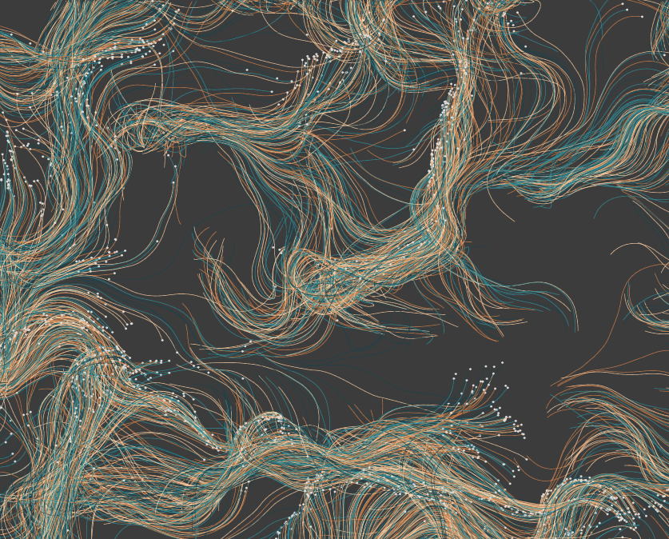
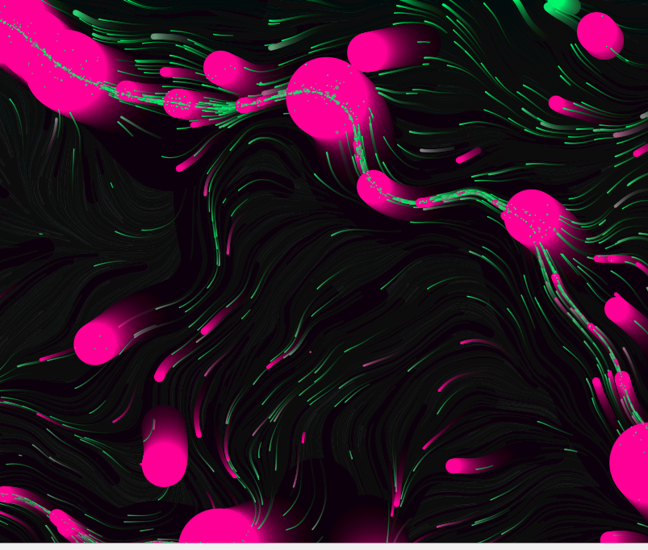

#### lwra4681_9103_tut2

## Summary:
The assignment task discussed here can be summarized as art appropriation using digital techniques to create an immersive experience.

### Part 1: Imaging Techniques

An imaging technique I find inspiring is **Flow Fields**.

Flow fields and Perlin noise are both techniques for simulating organic, fluid motion, making them perfect for emulating the dynamic energy of *The Scream*. By guiding particles through a flow field, you can give life to a static background image and add emotional intensity. This technique adds depth and realism to digital animations, allowing you to recreate the tension and movement within the artwork. It also offers flexibility in particle behavior, enhancing the sense of movement while retaining artistic integrity, making it beneficial for animations that aim to bring static works to life.

[Source](https://effyfan.com/2018/03/02/w6-van-gogh-flowfield/)

[Source](https://editor.p5js.org/balazsbotond/sketches/PHWaIRysX)

[Example: YouTube Video](https://www.youtube.com/watch?v=-mXZXe00XPQ)

### Part 2:
The link provided in this section describes particle system animation, driven by Perlin noise to create natural, fluid motion.

This code is well-suited for animating *The Scream*'s iconic sky, and using Perlin noise to guide particle motion will create dynamic, swirling effects. It is therefore useful because:

- **Perlin Noise**: Produces organic, smooth motion, ideal for emulating the sky’s chaotic energy.
- **Color Transitions**: `lerpColor` allows for seamless color blending, customizable to match the painting’s palette.
- **Particle Movement**: Particles flow in swirling paths, mimicking the tension and movement in the sky.
- **Continuous Animation**: Particles reset off-screen, creating endless motion, reflecting the emotional intensity of the painting.

These features enhance the expressive, immersive qualities for the appropriation.

[Example: p5.js Sketch](https://editor.p5js.org/rayam/sketches/5BA37__AO)
